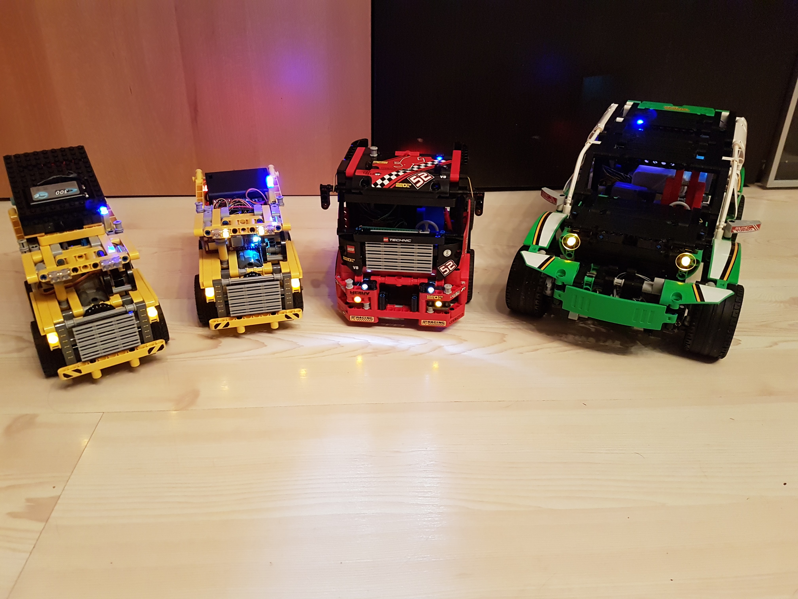

# Remote Lego project
This project contains all the bits needed to make a remote controllable (Lego) car model.

For a guide how to modify and build the physical part of this project please refer to the project page on Hackster.io ([Project page](https://www.hackster.io/22864/lego-car-remote-control-9b59a9))
It contains instructions and a BOM for what is needed to get a remote controllable (Lego) car model.

The repository consists of two main parts:
##[Embedded](embedded/README.md)
This is where all the code resides that is needed for the embedded car electronics. It contains code for the mainboard as well as for the control board.

## Remote control applications
There are some remote control applications available for controlling the car model:
- [**Android / Android Wear**](android/README.md)
This simple app consists of a smartphone application and a wearable application
- [**Tizen wear**](tizen/wear/README.md)
Contains a Tizen Wear app
- [**WebApp**](https://github.com/devmil/remotelego_app)
The WebApp is hosted in a separate Repository as the distributed version gets hosted on GitHub. If you only want to control your model then you simply can use the already deployed version of this app.

# Getting started
After preparing your model you want to control and after creating a Mainboard (either by using a pre-made PCB or a hole PCB) you can start off putting software onto your controllers.
Please refer to each components ReadMe to get a compile and flash guide:
- [ATMega32](embedded/Atmega/README.md)
- [RedBear DUO](embedded/RedBearDuo/README.md)
- [BLE Nano](embedded/BLENano/README.md)

For testing you can either use the WebApp (if you have an Android 6 device with Chrome and set it up correctly) or (more easier to set up) use the [Android app](android/README.md)