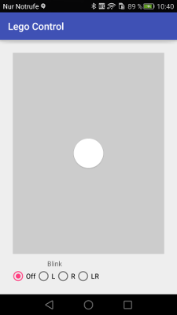

# Remote Lego - Android remote control
The lego remote control app contains three modules:
1. **app**
The Android smartphone application. It needs Android Lollipop+ (21+) because it uses the BLE API.

2. **legologic**
This module gets used by the app and the legowear module. It contains the communication bits with the remote car and the control UI.
3. **legowear**
The Android wear application using (as well as the app) the legologic bits to display the control UI and communicating with the (Lego) car model