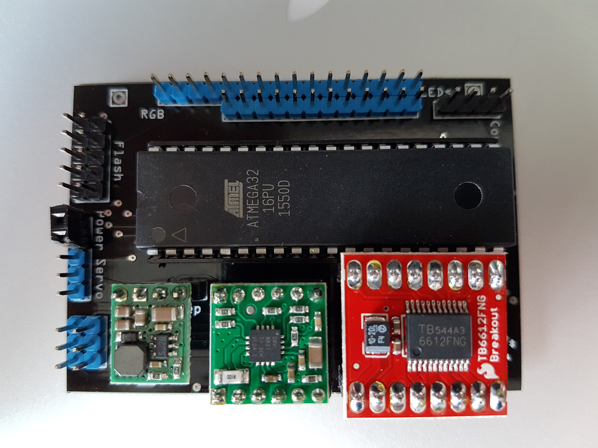
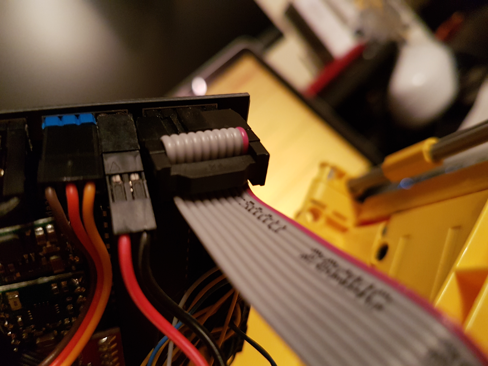

# Remote Lego - Embedded - Mainboard (Atmega)

The Mainboard is designed to be generic. It doesn't have any car specific logic. For example: It even doesn't have the logic to switch on the reverse driving lights when driving backwards. 

The idea behind that is to have a fully generic Mainboard with a very stable software and (hopefully) no variance at all.

## Prerequisites
In order to build and flash the software to the AVR you need to install:
###AVR toolchain
Installation depends on your development machine. For Mac just use homebrew and install it by executing:

`brew install avr-libc`

This toolchain should contain avr-gcc and avrdude
### Make
If you have a Mac make is part of XCode. Just make sure you have it installed.
On other machines you have to install make by using a package manager or setup.

###Burn AVR
The AVR has to be configured one time. To do that, plug the flash adapter cable to the mainboard and power it on. Please check the plug if the nose heads away from the mainboard (see picture)

Use a Terminal application of your choice, go to the main directory and execute 

`make prepare_avr`

## Build
Open your favourite Terminal, go to the main directory and enter

`make all` or `make rebuild`

## Flash
Make sure you have connected the AVT flash USB device to the Mainboard and that you have powered it up. Please check the plug if the nose heads away from the mainboard (see picture)
Open your favourite Terminal, go to the main directory and enter

`make flash`

## How it works
The AVR gets commands via UART and executes them.

It also awaits a periodical ping from the control module otherwise it switches everything off (speed, steering, ...) to make sure that a control module crash doesn't lead to a car that drives away :)

The only thing the Mainboard persists is the steering offset. As soon as the Control board sends a steering offset the AVR stores it to the EEPROM. This is done to have no strange behavior during boot (The AVR is immediately up and centers the servo. When the control module is up it sends the offset which leads to another angle (when offset !=0).

The AVR uses all 4 timer channels. One for the main motor, two for the feature motors and one for the servo. The servo timer is also used to update the internal clock and to make periodical checks (like if the feature motor timeout has been reached)